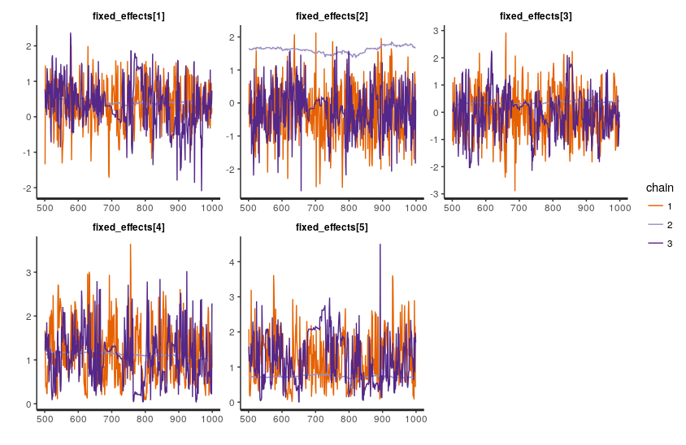

# Circular inference model in stan

We're trying to re-implement a circular inference model for information integration in stan.

(see figure 2 (especially 2c and 2d) in https://www.nature.com/articles/ncomms14218?WT.feed_name=subjects_neuroscience for intuitions about the model)

demo_data.csv is simulated data that looks and gets the same issues as the real data.

The core of the model is a weighting function F(information, weight) that gives the s shapes seem in the figures linked above, and the likelihood:

```stan
ChoiceRed ~ bernoulli_logit(
    intercept + 
    F(log_perceptual_information + loop_noise, weight_perceptual) +
    F(log_prior_information + loop_noise, weight_prior));
```

where the loop noise (a parameter in the paper above) is given by

```stan
loop_noise = F(loop_strength_perceptual .* log_perceptual_information, weight_perceptual) +
             F(loop_strength_prior .* log_prior_information, weight_prior);
```

We'd like to think we could improve on this by adding partial pooling over participants as well as including symptom strength in the model (as well as the ability to keep all the uncertainty in the model that we get from using stan in the first place)

A basic model with full pooling does fine: it has some problems recovering the loop strengths at any useful precision, but I suspect the original model couldn't really do that either.

Adding partial pooling on participants slows down the model a little bit, but chains seem healthy, the handful of divergences don't look too systematic, at it still gives us ~1/3 n_eff
(CircularInference_stamdemo_nosymptoms.stan)

BUT, adding symptom strength totally destroys the sampling
(CircularInference_stamdemo_symptoms.stan))
```
as = aSelf + aSelfP[Participant] + aSelfSymptoms * Symptoms;
```

