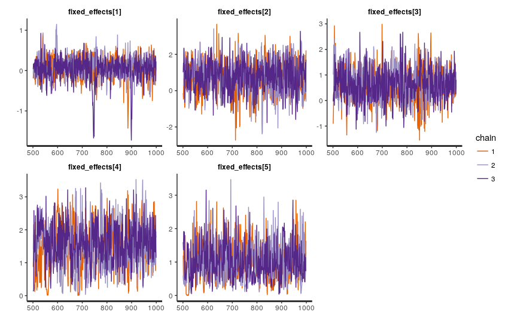
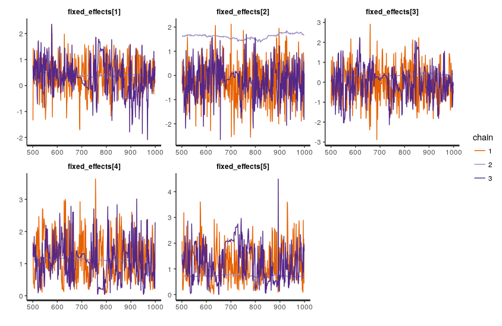
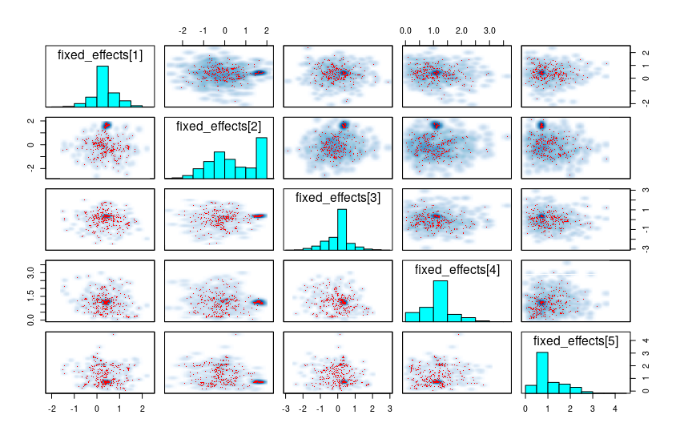
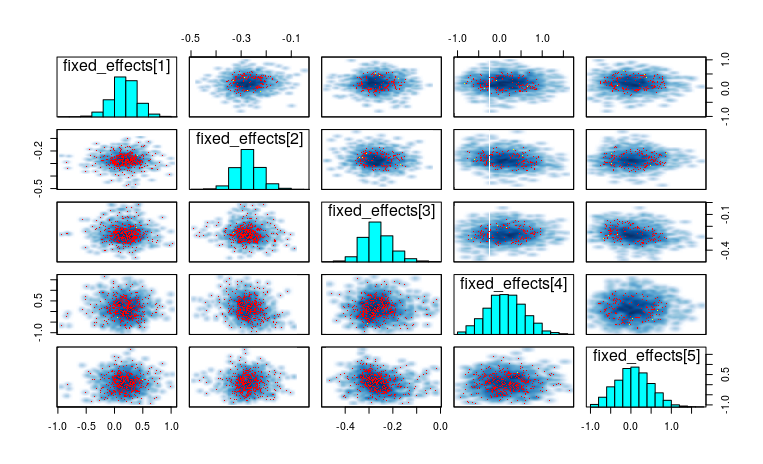
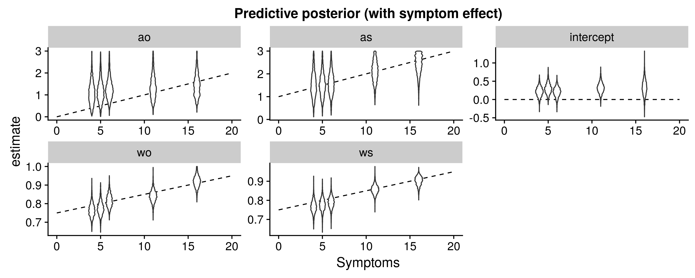
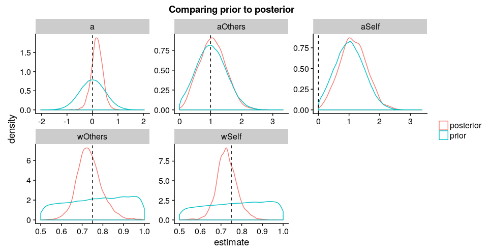

**Note:** Everything is kept for posterity, scroll down to update 1 for the state of the problem. 
Current model in `stan/CircularInference_stamdemo_symptoms_bounds.stan` does not use inv_logit as described below, instead I put somewhat sane bounds on the parameters. The real problem is that the loop strength parameters (aSelf, aOthers) don't move at all.
Stan discourse topic at http://discourse.mc-stan.org/t/circular-inference-model/2391


# Circular inference model in stan


I have some problems with a model that might be interesting to some of you

We're trying to re-implement a circular inference model for information integration in stan.

(see figure 2 (especially 2c and 2d) in https://www.nature.com/articles/ncomms14218?WT.feed_name=subjects_neuroscience for intuitions about the model)

demo_data.csv is simulated data that looks like and gets the same issues as the real data.

The core of the model is a weighting function F(information, weight) that gives the s shapes seem in the figures linked above, and the likelihood (with more intuitive parameter names here):

```stan
Choice ~ bernoulli_logit(
    intercept + 
    F(log_perceptual_information + loop_noise, weight_perceptual) +
    F(log_prior_information + loop_noise, weight_prior));
```

the log_*_information and the Choice are observed, while the the loop noise is the parameter:

```stan
loop_noise = F(loop_strength_perceptual .* log_perceptual_information, weight_perceptual) +
             F(loop_strength_prior .* log_prior_information, weight_prior);
```

We'd like to think we could improve on this by adding partial pooling over participants as well as including symptom strength in the model (as well as the ability to keep all the uncertainty in the model that we get from using stan in the first place)

A basic model with full pooling does fine with no divergences. It has some problems recovering the loop strengths at any useful precision, but I suspect the original model couldn't really do that either; it's just hidden because they only did point estimates.

Adding partial pooling on participants cost us some elegance (had to do logit transform, more on this). It slows down the model a little bit, but chains seem healthy, the handful of divergences don't look too systematic, and it still gives us about 1/3 n_eff
(CircularInference_stamdemo_nosymptoms.stan)

```stan
# logit transform to [0,1] interval then transform further to [.5,1] interval
weight_perceptual = inv_logit(wSelf + wSelfP[Participant] + wSelfSymptoms * Symptoms)/2+.5;
```



BUT, adding symptom strength totally destroys the sampling
(CircularInference_stamdemo_symptoms.stan))
```
loop_strength_perceptual = aSelf + aSelfP[Participant] + aSelfSymptoms * Symptoms;
```





```R
> print(symptom_model, pars = c("fixed_effects", "symptom_effects", "participant_effects", "lp__"))
Warning messages:
1: There were 930 divergent transitions after warmup. Increasing adapt_delta above 0.99 may help. See
http://mc-stan.org/misc/warnings.html#divergent-transitions-after-warmup
2: Examine the pairs() plot to diagnose sampling problems

Inference for Stan model: CircularInference_stamdemo_symptoms.
3 chains, each with iter=1000; warmup=500; thin=1; 
post-warmup draws per chain=500, total post-warmup draws=1500.

                            mean se_mean    sd    2.5%     25%     50%    75%  97.5% n_eff Rhat
fixed_effects[1]            0.37    0.04  0.52   -0.79    0.15    0.39   0.52   1.45   159 1.01
fixed_effects[2]            0.40    0.75  1.06   -1.57   -0.43    0.30   1.55   1.77     2 1.82
fixed_effects[3]            0.08    0.15  0.69   -1.56   -0.29    0.31   0.39   1.44    21 1.05
fixed_effects[4]            1.11    0.03  0.50    0.21    0.85    1.11   1.25   2.33   284 1.01
fixed_effects[5]            1.04    0.20  0.61    0.19    0.70    0.76   1.38   2.49     9 1.11
symptom_effects[1]         -0.04    0.00  0.06   -0.16   -0.07   -0.04  -0.02   0.07   212 1.01
symptom_effects[2]          0.63    0.46  0.58   -0.02    0.18    0.29   1.37   1.53     2 4.49
symptom_effects[3]         -0.51    0.68  0.84   -1.78   -1.65    0.01   0.12   0.28     2 9.44
symptom_effects[4]          0.28    0.20  0.41   -0.04   -0.02    0.15   0.41   1.53     4 1.21
symptom_effects[5]          0.69    0.07  0.57   -0.10    0.28    0.58   1.02   1.96    71 1.04
participant_effects[1,1]   -0.57    0.52  0.71   -1.60   -1.40   -0.33   0.00   0.58     2 2.11
participant_effects[1,2]    1.09    0.11  1.34   -1.04    0.40    1.01   1.44   4.53   137 1.02
participant_effects[1,3]   -0.81    0.16  0.97   -3.21   -1.08   -0.59  -0.47   0.92    35 1.05
participant_effects[1,4]    0.48    0.19  4.20   -0.81   -0.13   -0.01   0.28   3.69   501 1.01
participant_effects[1,5]    0.89    0.20  3.56   -0.91   -0.09    0.40   1.31   4.59   307 1.02
participant_effects[2,1]   -0.02    0.04  0.38   -0.81   -0.17   -0.07   0.13   0.84    98 1.05
participant_effects[2,2]   -0.30    0.10  1.20   -2.48   -0.62   -0.47   0.00   2.43   137 1.01
participant_effects[2,3]    0.09    0.30  1.03   -2.28   -0.45    0.27   0.65   1.97    12 1.08
participant_effects[2,4]    0.71    0.15  2.89   -0.89   -0.05    0.39   1.08   2.76   349 1.01
participant_effects[2,5]    0.46    0.29  4.32   -0.88   -0.42   -0.20   0.21   4.29   230 1.02
participant_effects[3,1]    0.08    0.19  0.42   -0.99   -0.09    0.13   0.37   0.67     5 1.19
participant_effects[3,2]   -0.10    0.68  1.32   -3.39   -0.79    0.04   0.66   1.51     4 1.32
participant_effects[3,3]    1.28    0.21  0.95   -0.03    0.76    0.97   1.69   3.63    21 1.09
participant_effects[3,4]    0.18    0.56  3.83   -0.93   -0.75   -0.15   0.29   3.85    47 1.02
participant_effects[3,5]    0.59    0.29  3.44   -0.84   -0.10    0.00   0.31   4.37   137 1.03
participant_effects[4,1]    0.11    0.02  0.34   -0.55   -0.04    0.04   0.23   0.98   308 1.03
participant_effects[4,2]   -0.98    0.05  0.77   -2.99   -1.14   -1.06  -0.55   0.32   207 1.02
participant_effects[4,3]   -0.85    0.48  0.86   -2.18   -1.58   -0.92  -0.16   0.74     3 1.33
participant_effects[4,4]    0.02    0.64  2.00   -1.18   -0.90   -0.18   0.23   3.73    10 1.07
participant_effects[4,5]    0.83    0.31  4.90   -0.78   -0.02    0.29   0.40   5.29   245 1.02
participant_effects[5,1]    0.62    0.60  0.79   -0.54   -0.01    0.28   1.54   1.76     2 2.58
participant_effects[5,2]   -0.16    0.62  1.01   -1.53   -1.05   -0.13   0.52   1.81     3 1.48
participant_effects[5,3]    0.22    0.46  0.82   -1.49   -0.34    0.34   0.74   1.53     3 1.32
participant_effects[5,4]    0.37    0.05  0.98   -0.80   -0.07    0.17   0.51   2.93   339 1.00
participant_effects[5,5]    0.85    0.23  3.88   -0.85   -0.08    0.38   0.98   3.92   276 1.02
lp__                     -122.16   31.82 39.63 -184.49 -172.99 -101.43 -91.51 -77.61     2 5.84

Samples were drawn using NUTS(diag_e) at Mon Oct 30 23:32:58 2017.
```


Things I tried that didn't help:
* Letting it run for 10000 iterations
* Fiddling with the priors to ~ normal(0,0.1) or normal(0, 10)
* z-scaling symptom data
* Participant pooling on the symptom parameter. This doesn't really make sense though as each participant has just one value for the symptom strength.
* Fiddling with max_treedepth and adapt_delta

Ideas I still vaguely feel like I haven't explored enough
* Put very tight priors on the loop strength parameters due to them flatting out so much when far from zero
* Do away with the logit transform on the w parameters. This is all to work around the specific boundaries the function expects. We didn't need this for the no-symptom model since we could do `participant_effects ~ multi_normal(main_effects, sigma)` and could just put bounds on the main effects and the participant effects parameters. I asked [last month](http://discourse.mc-stan.org/t/bounds-depending-on-parameter-error-lub-constrain-lb-is/1937/3) about working out those bounds, but now I can't see how to do the same for three interdependent parameters (ie wSelf, wSelfP, wSelfSymptoms)


So, in summary: We have five "fixed effects" parameters. We'd like to put glm-style participant and symptom effects on each of them. Adding symptom strength ruined the sampling. So that may be the issue, or perhaps that in combination with other quirks of the model.

Thoughts?


### Update 1:
* I somewhat fixed the bounds, which means I could get rid of the inv_logit transform on w. Chains seems a lot better (Rhat <= 1.01)
* Tried mcmc_parcoord which seems really nice, but in my case, the divergences are spread almost randomly over the parameter space.

* Ran one simulation on the (now bounded and logit-less) symptom model. It recovered the weights (including symptom effect) okay-ish, but still has problems with the loop strenghts. Plots of results in simulation/


This is very similar to simulations I ran a while ago before trying to add symptom strength (recovered w, but didn't move a at all). So, I guess now that I fixed the most obviously broken thing (the logit transform on the weights), the underlying issues are visible again: the loop strength parameter isn't being affected by the data at all (don't ask me why I didn't make a plot like this before).


In effect, the goal of the model is trying to condition (a non-standard specification of) uncertainty/bias on symptom strength. Are there any obvious reasons why it isn't doing anything in my model? (stan/CircularInference_stamdemo_symptoms_bounds.stan on github)

### Update 2
@bob
inv_logit(x) and putting sane bounds on w are two different approaches to the same problem.

I've done some things with the bounds between the first and second post (model in stan/...bounds.stan), but I don't see how to proceed. Symptom only goes to max 20 in this data, so putting lower=-aSelf/20 on the symptom coefficient in the example below works okay-ish (i get ~5 warnings but then it gets going). But the bounds on the participant parameter would depend on the symptom strength of that participant, and I guess vector bounds are not supported: `expression denoting real required; found type=vector`

```stan

real<lower=0> aSelf;
real<lower=-aSelf/20> aSelfSymptoms;
// works well enough I think
vector<lower=-aSelf>[P] aSelfP;
// I'd want this but vector bounds don't seem to be supported
vector<lower=-aSelf - aSelfSymptoms * SymptomsP>[P] aSelfP;

```

I guess I'd have to define each participant's effect in order to put individual bounds on them, but that seems silly and not extendable.
