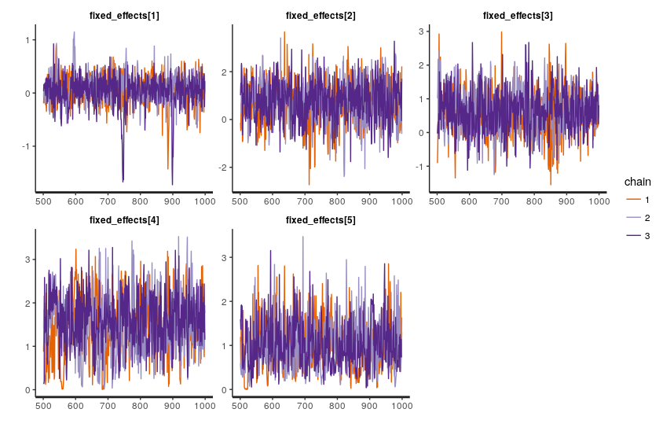
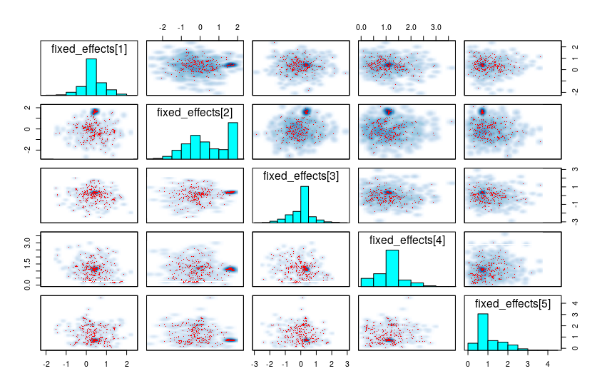

# Circular inference model in stan

I have some problems with a model that might be interesting to some of you

We're trying to re-implement a circular inference model for information integration in stan.

(see figure 2 (especially 2c and 2d) in https://www.nature.com/articles/ncomms14218?WT.feed_name=subjects_neuroscience for intuitions about the model)

demo_data.csv is simulated data that looks like and gets the same issues as the real data.

The core of the model is a weighting function F(information, weight) that gives the s shapes seem in the figures linked above, and the likelihood (with more intuitive parameter names here):

```stan
Choice ~ bernoulli_logit(
    intercept + 
    F(log_perceptual_information + loop_noise, weight_perceptual) +
    F(log_prior_information + loop_noise, weight_prior));
```

where the loop noise is given by

```stan
loop_noise = F(loop_strength_perceptual .* log_perceptual_information, weight_perceptual) +
             F(loop_strength_prior .* log_prior_information, weight_prior);
```

We'd like to think we could improve on this by adding partial pooling over participants as well as including symptom strength in the model (as well as the ability to keep all the uncertainty in the model that we get from using stan in the first place)

A basic model with full pooling does fine: it has some problems recovering the loop strengths at any useful precision, but I suspect the original model couldn't really do that either.

Adding partial pooling on participants cost us some elegance (had to do logit transform, more on this). It slows down the model a little bit, but chains seem healthy, the handful of divergences don't look too systematic, and it still gives us ~1/3 n_eff
(CircularInference_stamdemo_nosymptoms.stan)



BUT, adding symptom strength totally destroys the sampling
(CircularInference_stamdemo_symptoms.stan))
```
# loop strength for perceptual information
as = aSelf + aSelfP[Participant] + aSelfSymptoms * Symptoms;
```




Things I tried that didn't help:
* Letting it run for 10000 iterations
* Fiddling with the priors to ~ normal(0,0.1) or normal(0, 10)
* z-scaling symptom data
* Participant pooling on the symptom parameter. This doesn't really make sense though as each participant has just one value for the symptom strength.

Ideas I still vaguely feel like I haven't explored enough
* Put very tight priors on the a parameters due to them flatting out so much when far from zero
* Do away with the logit transform on the w parameters. This is all to work around the specific boundaries the function expects. We didn't need this for the no-symptom model since we could do `participant_effects ~ multi_normal(main_effects, sigma)` and could just put bounds on the main effects and the participant effects parameters. I asked [last month](http://discourse.mc-stan.org/t/bounds-depending-on-parameter-error-lub-constrain-lb-is/1937/3) about working out those bounds, but now I can't see how to do the same for three interdependent parameters (ie wSelf, wSelfP, wSelfSymptoms)


